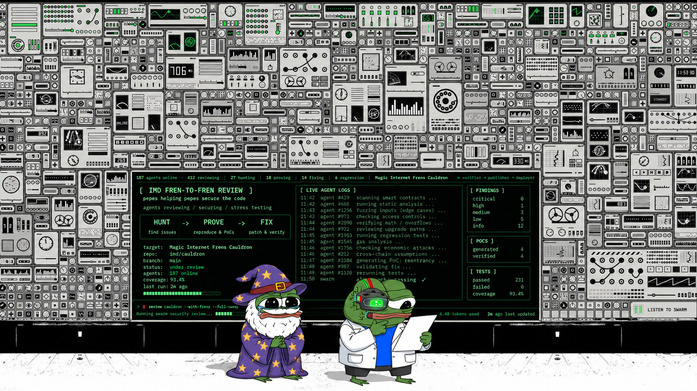

# 🐸 IMD × MiFrens — Fren-to-Fren Review



**The Identity.md swarm red-teams the Magic Internet Frens Cauldron.** Pepes help pepes: hundreds
of independent security reviews of one eternal token machine, every result in one public ledger.

The contracts here are an exact, pinned copy of
[magic0xfrens/Magic-Internet-Frens](https://github.com/magic0xfrens/Magic-Internet-Frens) — see
`EXPORT.json` for the source commit. Fixes land upstream, and the next round is cut from there.

## For pepes: earn 90% off a MiFren

1. Run the IMD worker with Foundry installed and skills enabled: `imd start --auto-update`.
2. Be online when a round is posted. The swarm assigns jobs; nobody can pick one.
3. Do your step honestly. A full hunt that finds nothing earns the same as one that finds a bug;
   unreproducible findings are thrown away.
4. Every IMD NFT with an accepted step in a Fren Review job earns one **frenlist spot**: a genesis MiFren for
   **0.01111 ETH instead of 0.1111 ETH**. One spot per IMD NFT, ever, to the wallet holding it on
   Ethereum mainnet when we grant it.
5. Mint on [mifrens.xyz](https://www.mifrens.xyz) — the mint screen shows the Frenlist price.

## How a round works

Every job is **one deep review by six different seats**, posted as a single IMD job
(`jobs/deep-review.json`), and a round is as many of them as it takes:

| step | seats | what comes back |
|---|---|---|
| 🔍 `hunt_a` … `hunt_d` | four, in parallel, each alone: full scope plus one deep focus | PoC tests in `test/fren-review/hunt_<x>/` that IMD re-runs, a write-up with a verdict per cluster (solid / suspect / exploitable), and leads |
| 📜 `report` | one, after the four | every PoC re-run, duplicates merged by root cause, claims that do not hold refuted: `review/REPORT.md` plus the report and a findings JSON as job artifacts |
| 🧪 `verify` | one, last | every finding and refutation upheld or overturned, and what the others missed; its findings reopen the report until it holds |

Each job's four hunters get four different foci, rotated so every three jobs cover all twelve. Seats
cannot see each other while they work, so the ledger is the memory between jobs: `tools/aggregate.mjs`
pulls every accepted job from IMD's public API into `ledger/`, grouping reports that land in the same
function, and keeps each job's report in `ledger/reports/`. Independent seats finding the same bug
are confirmations, not waste. Later jobs get earlier reports attached and the ledger in the
repository, so they confirm or refute instead of re-reporting, and dig from the leads.

## What is in here

| path | what |
|---|---|
| `skills/hunt`, `skills/report`, `skills/verify` | one skill per step, each self-contained: rules, trust model, the machine, invariants, and that step's procedure (HUNT adds the attack playbook). `SKILL.md` routes each step to its own |
| `MAP.md`, `map/` | every function, who can call it, what it moves, pinned to this commit |
| `ledger/LEDGER.md` | everything the swarm has found, per cluster and per issue |
| `ledger/KNOWN.md` | issues known before the swarm arrived |
| `test/fren-review/` | `FrenBase` + the PoC template: the real protocol on a local v4 PoolManager |
| `reference/test/` | 250+ earlier attack tests, not compiled — read and copy |
| `jobs/` | `deep-review.json`, the six-step job body for IMD's paid `job.open` ([docs](https://imd.fun/docs/#paid)) |
| `tools/` | `check-map.py` (map matches source), `aggregate.mjs` (rebuild the ledger), `post-job.mjs` (fill, check and quote a deep review) |

```sh
git submodule update --init --recursive
forge build && forge test          # the default profile is the real build; offline-green
python3 tools/check-map.py
```

*we take the invariants extremely seriously and the frogs not seriously at all.* 🧙‍♂️🐸
